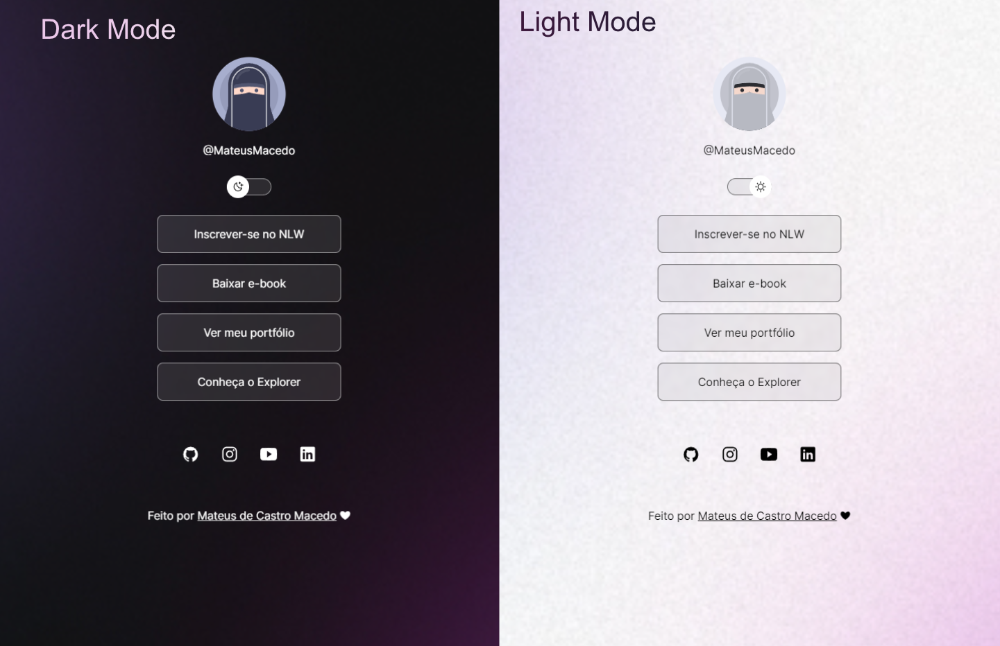

<h1 align="center"> DevLinks </h1>

Projeto pessoal realizado com as atividade didáticas apresentadas pela Rocketseat.

  <a href="#-tecnologias">Tecnologias</a>&nbsp;&nbsp;&nbsp;|&nbsp;&nbsp;&nbsp;
  <a href="#-projeto">Projeto</a>&nbsp;&nbsp;&nbsp;|&nbsp;&nbsp;&nbsp;
  <!-- <a href="#-layout">Layout</a>&nbsp;&nbsp;&nbsp;|&nbsp;&nbsp;&nbsp; -->
  <a href="#memo-licença">Licença</a>

  

 

  

## 🚀 Tecnologias

Esse projeto foi desenvolvido com as seguintes tecnologias:

- HTML e CSS
- JavaScript
- Git e Github
- Figma

## 💻 Projeto

O Devlinks é uma página de apresentação do usuário com links de redirecionamento para suas redes sociais, serviços e portfolio.

<!-- ## 🔖 Layout -->

## :memo: Licença

Esse projeto está sob a licença MIT.

 
 
 
 

Feito com ♥ by Mateus de Castro Macedo 👨‍💻

